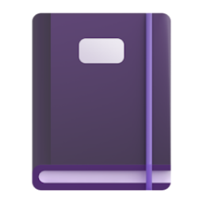

# </img> Note Tree
A simple C++ note taking application written with Qt5.

## Build
### Windows
- Install and configure Visual Studio 2019.
- Download Qt5 from [qt.io](https://qt.io/download).
- At the project root, run `qmake -tp vc`.
- Open the project.
- Running `scripts/win32-msbuild.bat` will remake the project and build in the same motion, allowing for the git version to be properly generated and displayed in the about menu correctly.

### macOS
- Install and configure Xcode.
- Download Qt5 (`brew install qt5`).
- At the project root, run `qmake`.
- Build the project with `make`.
- Making an Xcode project can be done with `qmake -spec macx-xcode`.

### Linux
- Download Qt5 from the package manager of the distribution.
- At the project root, run `qmake`.
- Build the project with `make`.

## Download
Compiled binaries exist for Windows, macOS, and Linux via GitHub actions. Click on the actions tab, then the most recent action to find the releases. Some oddities exist with the executables due to OS-specific bugs, GitHub actions itself, or my own lack of testing tools. These oddities are listed below grouped by platform.
### Windows
- Does not include any Qt libraries, putting the executable file in a folder of another Qt app (Wireshark, OBS, etc) will make it run flawlessly.
  - Will be fixed soon:tm:.

### macOS
- App is not code signed in any way, meaning most(?) Macs will refuse to run it, claiming it simply "cannot be opened". Signing the app will fix the problem, but the signature is tied to the machine. Have not invested enough into getting a proper code signature because of how Apple handles code signing.
  - The README file zipped with the build contains simple instructions on how to get it to run.
- Only pre-compiled x86_64 binaries exist, GitHub actions does not have the option to run on Apple Silicon and the action only gets x86 builds of Qt, not ARM. Probably possible to fix with enough tinkering, but as of now there is no native Apple Silicon build on GitHub. App works flawlessly through Rosetta 2, and building the source code on ARM produces a perfectly working version.

### Linux
- Same as Windows, doesn't include any Qt libraries. A lot less hack-y to fix however, just download Qt5 5.15 for the distribution and it should work (Ubuntu's Qt is only 5.12? Might require someone to build from source which is kinda dumb?). Definitely something that will be fixed soon:tm:.
  - Only proper testing and development has occurred on Arch Linux with [this](https://archlinux.org/packages/extra/x86_64/qt5-base/) Qt package.